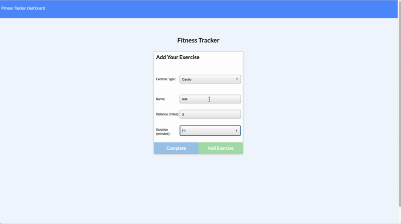

# workout_tracker_17

## User Story

* As a user, I want to be able to view create and track daily workouts. I want to be able to log multiple exercises in a workout on a given day. I should also be able to track the name, type, weight, sets, reps, and duration of exercise. If the exercise is a cardio exercise, I should be able to track my distance traveled.

# Technologies
HTML, CSS, JavaScript,  Bootstrap, Heroku

 
NPM:  express, mongoose, morgan

## Credit:

Triology and North Western Bootcamp provide the front end material and Instructor's advise.

## Installation 

`npm run seed `

`node server.js`

`npx nodemon server.js`

# Website Deploy Links
GitHub: https://github.com/Oliviapark113/workout_tracker_17/tree/main/Develop

Heroku: https://fathomless-fjord-12826.herokuapp.com/ 